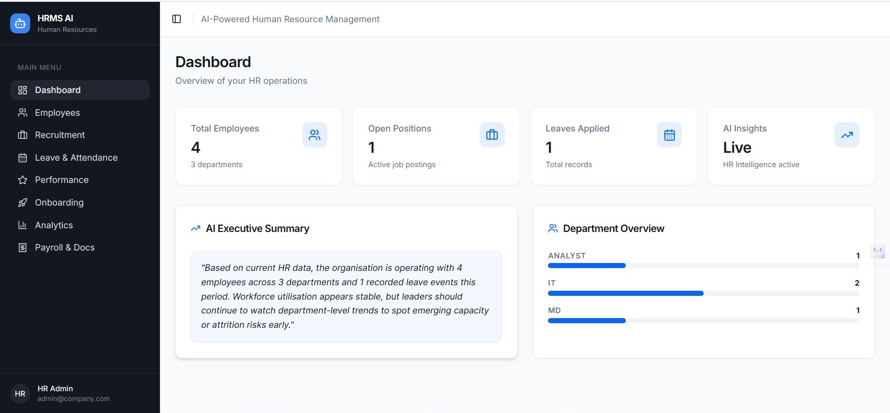
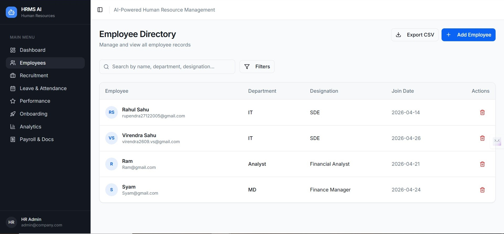
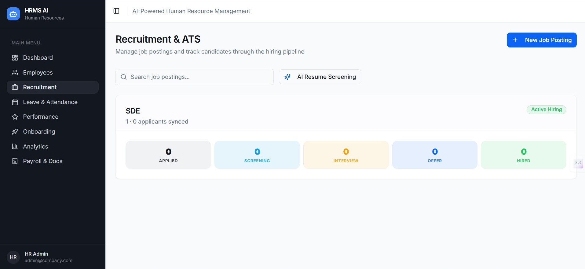
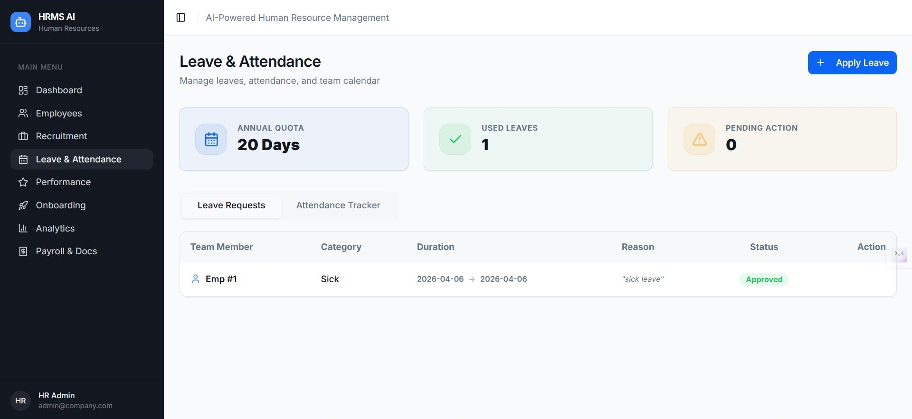
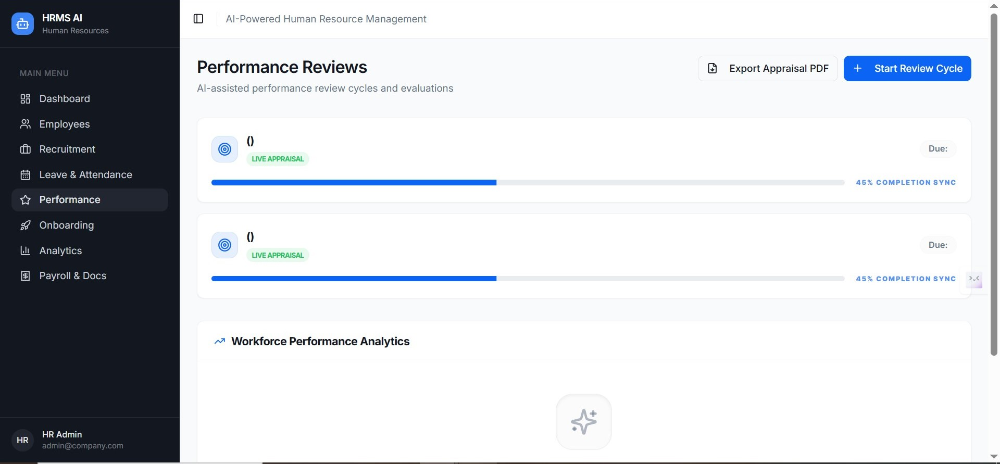

## AI HR Genius – HRMS Dashboard

AI HR Genius is a modern HRMS (Human Resource Management System) with an AI‑powered backend. It covers core HR operations (employees, recruitment, leave, performance, onboarding, analytics, payroll/docs) with a clean React dashboard and FastAPI backend. Google Gemini is used for analytics, employee bios, resume scoring, and performance summaries.

---

## Tech Stack

- **Frontend**
  - React 18 + TypeScript
  - Vite
  - Tailwind CSS + shadcn‑ui
  - React Router
- **Backend**
  - FastAPI
  - SQLAlchemy + SQLite
  - Pydantic / Pydantic Settings
  - Alembic (migrations scaffolded)
- **AI / PDF**
  - Google Gemini (`generativelanguage.googleapis.com`)
  - `google-generativeai` Python SDK
  - ReportLab (PDF offer letters)
- **Other**
  - Node.js + npm
  - Python 3.13+
  - `python-dotenv` for env config

---

## Project Structure

```text
ai-hr-genius-main/
  backend/
    app/
      ai/               # Gemini integration helpers
      models/           # SQLAlchemy models
      routes/           # FastAPI routers (employees, recruitment, leave, performance, analytics, extra, onboarding)
      schemas/          # Pydantic schemas
      database.py       # DB session + Base
      main.py           # FastAPI app entrypoint
    .env                # Backend environment variables (local)
    requirements.txt
  frontend/
    src/
      components/       # Reusable UI (cards, state components, layout, etc.)
      pages/            # Route pages: Dashboard, Employees, Recruitment, Leave, Performance, Onboarding, Analytics, Extra
      config.ts         # BASE_URL for API
    package.json
    vite.config.ts
```

---

## Setup Instructions

### 1. Prerequisites

- Node.js 18+ (with npm)
- Python 3.13+
- Recommended: virtualenv for backend

### 2. Backend Setup

```bash
cd backend

# (optional) create venv
python -m venv venv
# Windows
venv\Scripts\activate
# macOS/Linux
# source venv/bin/activate

pip install -r requirements.txt
```

Create or edit `.env` in `backend/`:

```env
SECRET_KEY=your-super-secret-key-here
ALGORITHM=HS256
ACCESS_TOKEN_EXPIRE_MINUTES=30
DATABASE_URL=sqlite:///./hrms.db

GEMINI_API_KEY=YOUR_GEMINI_API_KEY_HERE
```

Start the backend:

```bash
cd backend
uvicorn app.main:app --reload --host 127.0.0.1 --port 8000
```

- API root: `http://127.0.0.1:8000/`
- Swagger docs: `http://127.0.0.1:8000/docs`

### 3. Frontend Setup

```bash
cd frontend
npm install
npm run dev
```

- Frontend dev server: `http://localhost:8080/`

Ensure `BASE_URL` in `frontend/src/config.ts` points to the backend:

```ts
export const BASE_URL = "http://127.0.0.1:8000";
```

### 4. Build for Production

```bash
# Frontend build
cd frontend
npm run build
```

The backend is already production‑ready with uvicorn; for real deployment, run it with a process manager and/or behind a reverse proxy.

---

## Features

- **Dashboard**
  - Overview cards: total employees, open positions, leave records, departments.
  - Department overview bar chart based on live headcount.
  - **AI Executive Summary** generated via Gemini:
    - 2–3 sentence HR summary.
    - Non‑blocking: core dashboard loads immediately, AI section has its own loading and fallback.

- **Employee Directory**
  - Add / delete employees.
  - Search by name, department, designation.
  - Filter dialog: department + designation filters.
  - CSV export via `/api/employees/export/csv`.

- **Recruitment & ATS**
  - Job postings with candidate pipeline across stages (Applied → Hired).
  - Candidate creation and resume upload.
  - **AI resume scoring** using Gemini:
    - Match score vs job description.
    - Strengths, gaps, and suggested interview questions.

- **Leave & Attendance**
  - Leave application list and status updates (e.g. approve / reject).

- **Performance Reviews**
  - Promotion / appraisal cycles.
  - Create review cycles from the UI; data stored in `promotion_cycles`.
  - Reviews per employee:
    - Self rating & comments.
    - Manager rating & comments.
    - **AI performance summary** (summary, rating mismatch, suggestions).

- **Onboarding Assistant**
  - Chat endpoint that uses uploaded docs/policies to answer new‑hire questions.
  - Graceful fallback text when no docs are available.

- **Analytics**
  - Headcount by department (live).
  - Dynamic Workforce Allocation Strategy donut charts based on real headcount distribution.
  - AI Executive Intelligence card using the same Gemini‑backed analytics summary.

- **Payroll & Docs**
  - ARTH‑branded offer letter PDF generation with ReportLab.
  - Simple payroll summary stub endpoint with base/deductions/net salary example.

---

## Known Limitations

- **Authentication & Authorization**
  - JWT helpers and auth routes exist, but many APIs are currently open for demo.
  - No full role‑based permission model yet (e.g. HR vs managers vs employees).

- **Database & Migrations**
  - SQLite is used by default.
  - Alembic is present but migrations are minimal; schema changes may require DB reset during development.

- **AI Dependencies**
  - Uses the `google-generativeai` SDK, which is deprecated in favour of `google-genai` (warning logged at runtime).
  - AI endpoints fall back to heuristic text if the model is slow or unavailable.

- **Analytics Metrics**
  - Attrition and average tenure values in departmental metrics are demo/randomised.
  - Some progress/percentage values are illustrative rather than computed from full historical data.

- **File Storage**
  - Resumes and employee documents are stored on the local filesystem under `uploads/`.
  - No cloud storage (S3, GCS, etc.) integration yet.

- **Validation & UX**
  - API validation is basic; some flows still rely on generic toasts instead of granular inline form errors.

---

## Screenshots / GIFs

Current screenshots (stored under `frontend/public/img/`):











---

## Future Improvements

- Add full authentication and role‑based permissions (HR admin, manager, employee self‑service).
- Migrate from `google-generativeai` to `google-genai` with streaming support.
- Compute real attrition and tenure metrics from historical employment and leave data.
- Add more detailed filters, saved views, and export options across modules.
- Integrate cloud storage for documents and resumes.
